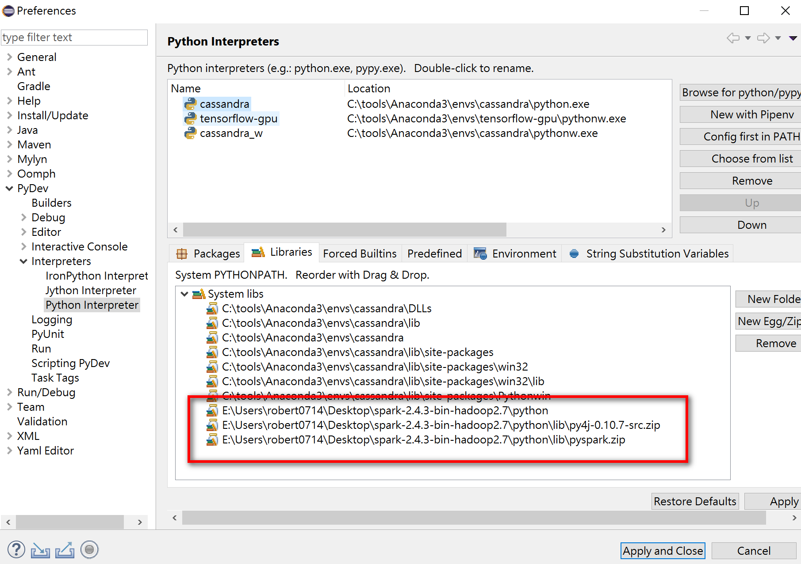
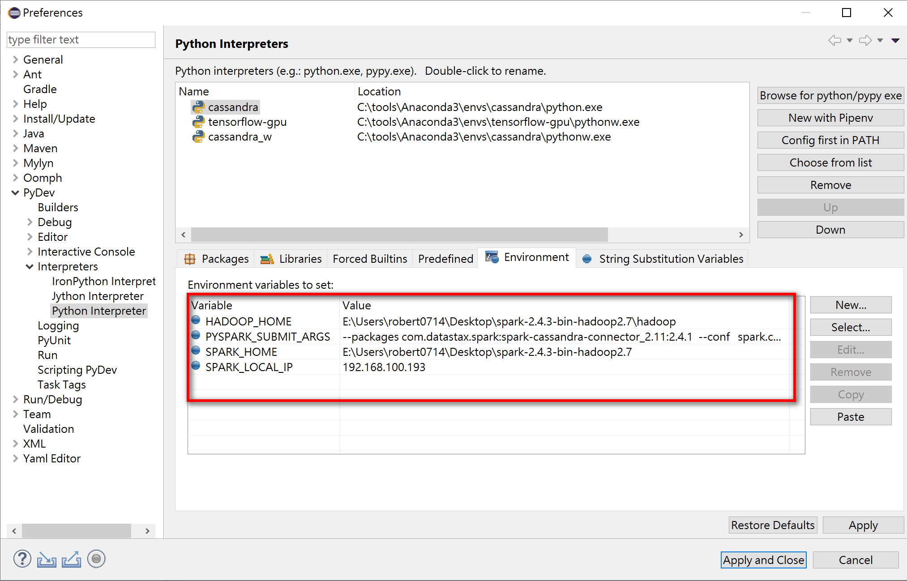

```
~$ docker-compose -f docker-compose-mssql.yaml up -d


mssql> CREATE TABLE users (user_id int PRIMARY KEY, fname text, lname text);
mssql> INSERT INTO users (user_id, fname, lname) VALUES (1745, 'john', 'smith');
mssql> INSERT INTO users (user_id, fname, lname) VALUES (1744, 'john', 'doe');
mssql> INSERT INTO users (user_id, fname, lname) VALUES (1746, 'john', 'smith');
mssql> use mykeyspace;
mssql> select * from users;

 user_id | fname | lname
---------+-------+-------
    1745 |  john | smith
    1744 |  john |   doe
    1746 |  john | smith

(3 rows)


## Using Apache Spark-Cassandra Connector
1. Download [Spark](http://apache.stu.edu.tw/spark/spark-2.4.3/spark-2.4.3-bin-hadoop2.7.tgz) and extract it .
1. Install Scala 2.12.x

### pyspark

```bash
pyspark --packages "com.microsoft.sqlserver:mssql-jdbc:7.4.1.jre8"      --driver-class-path  "E:/Users/robert0714/.ivy2/jars/com.microsoft.sqlserver_mssql-jdbc-7.4.1.jre8.jar"

pyspark  --packages  com.microsoft.sqlserver:mssql-jdbc:7.4.1.jre8  --driver-class-path  ${USERHOME}/.ivy2/jars/com.microsoft.sqlserver_mssql-jdbc-7.4.1.jre8.jar
```
In Python prompt,

```python
>>> from pyspark.sql import SparkSession
>>> from pyspark.sql import SQLContext
>>> spark = SparkSession \
                .builder \
                .appName("Python Spark SQL data source example") \
                .getOrCreate()
>>> sc = spark.sparkContext
>>> sqlContext = SQLContext(sc)
>>> jdbcDF = spark.read.format("jdbc") \
                .option("url", "jdbc:sqlserver://192.168.99.104:1433;databaseName=master") \
                .option("dbtable", "users") \
                .option("user", "sa") \
                .option("password", "1qaz2wsx#EDC").load()
>>> jdbcDF.show()
+-----+-----+-------+
|lname|fname|user_id|
+-----+-----+-------+
|  doe| john|   1744|
|smith| john|   1745|
|smith| john|   1746|
+-----+-----+-------+
```

### spark-shell 

```bash
spark-shell  --packages "com.microsoft.sqlserver:mssql-jdbc:7.4.1.jre8"      --driver-class-path  "E:/Users/robert0714/.ivy2/jars/com.microsoft.sqlserver_mssql-jdbc-7.4.1.jre8.jar"

spark-shell  --packages  com.microsoft.sqlserver:mssql-jdbc:7.4.1.jre8  --driver-class-path  ${USERHOME}/.ivy2/jars/com.microsoft.sqlserver_mssql-jdbc-7.4.1.jre8.jar
```

In scala prompt,

```scala
Spark context Web UI available at http://EMOIS004:4040
Spark context available as 'sc' (master = local[*], app id = local-1566737877821).
Spark session available as 'spark'.
Welcome to
      ____              __
     / __/__  ___ _____/ /__
    _\ \/ _ \/ _ `/ __/  '_/
   /___/ .__/\_,_/_/ /_/\_\   version 2.4.3
      /_/

Using Scala version 2.11.12 (Java HotSpot(TM) 64-Bit Server VM, Java 1.8.0_161)
Type in expressions to have them evaluated.
Type :help for more information.

scala> val jdbcDF = spark.read.format("jdbc").option("url", "jdbc:sqlserver://192.168.99.104:1433;databaseName=master").option("dbtable", "users").option("user", "sa").option("password", "1qaz2wsx#EDC").load()
jdbcDF: org.apache.spark.sql.DataFrame = [user_id: int, fname: string ... 1 more field]

scala> jdbcDF.show()
+-------+-----+-----+
|user_id|fname|lname|
+-------+-----+-----+
|   1744| john|  doe|
|   1745| john|smith|
|   1746| john|smith|
+-------+-----+-----+


scala>
```

```
### windows
http://deelesh.github.io/pyspark-windows.html

#### Installing winutils
Let’s download the winutils.exe and configure our Spark installation to find winutils.exe.
1.  [hadoop-2.7.1](https://github.com/steveloughran/winutils/raw/master/hadoop-2.7.1/bin/winutils.exe)
1.  [hadoop-2.8.1](https://github.com/steveloughran/winutils/raw/master/hadoop-2.8.1/winutils.exe)
1.  [hadoop-3.0.0](https://github.com/steveloughran/winutils/raw/master/hadoop-3.0.0/bin/winutils.exe)

steps:
1.  Create a *hadoop\bin* folder inside the SPARK_HOME folder.
1.  Download the winutils.exe for the version of hadoop against which your Spark installation was built for.
1.  Create a system environment variable in Windows called *SPARK_HOME* that points to the SPARK_HOME folder path. 
1.  Create another system environment variable in Windows called *HADOOP_HOME* that points to the hadoop folder inside the SPARK_HOME folder.
1.  Since the *hadoop* folder is inside the SPARK_HOME folder, it is better to create *HADOOP_HOME* environment variable using a value of *%SPARK_HOME%\hadoop*. That way you don’t have to change HADOOP_HOME if SPARK_HOME is updated.

```python
>>> from pyspark.sql import SparkSession
>>> from pyspark.sql import SQLContext
>>> spark = SparkSession \
                .builder \
                .appName("Python Spark SQL data source example") \
                .getOrCreate()
>>> sc = spark.sparkContext
>>> sqlContext = SQLContext(sc)
>>> jdbcDF = spark.read.format("jdbc") \
                .option("url", "jdbc:sqlserver://192.168.99.104:1433;databaseName=master") \
                .option("dbtable", "users") \
                .option("user", "sa") \
                .option("password", "1qaz2wsx#EDC").load()
>>> jdbcDF.show()
+-----+-----+-------+
|lname|fname|user_id|
+-----+-----+-------+
|  doe| john|   1744|
|smith| john|   1745|
|smith| john|   1746|
+-----+-----+-------+
```

## Pydev

>


| Variable | Value |
| --- | --- |
| HADOOP_HOME | E:\Users\robert0714\Desktop\spark-2.4.3-bin-hadoop2.7\hadoop |
| PYSPARK_SUBMIT_ARGS | --packages com.microsoft.sqlserver:mssql-jdbc:7.4.1.jre8   --driver-class-path E:/Users/robert0714/.ivy2/jars/com.microsoft.sqlserver_mssql-jdbc-7.4.1.jre8.jar   pyspark-shell |
| SPARK_HOME | E:\Users\robert0714\Desktop\spark-2.4.3-bin-hadoop2.7 |




```Python
# -*- coding: UTF-8 -*-

from pyspark.sql import SparkSession
from pathlib import Path

if __name__ == "__main__": 
        try: 
            spark = SparkSession \
                .builder \
                .config("spark.driver.extraClassPath",str(Path.home())+"/.ivy2/jars/com.microsoft.sqlserver_mssql-jdbc-7.4.1.jre8.jar") \
                .appName("Python Spark SQL data source example") \
                .getOrCreate()
            
            jdbcDF = spark.read.format("jdbc") \
                .option("url", "jdbc:sqlserver://192.168.99.104:1433;databaseName=master") \
                .option("dbtable", "users") \
                .option("user", "sa") \
                .option("password", "1qaz2wsx#EDC").load()
                
            jdbcDF.show()
        except Exception: 
            print('exception')
            print(Exception)
        finally:
            print('end')
```